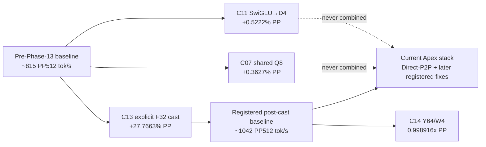
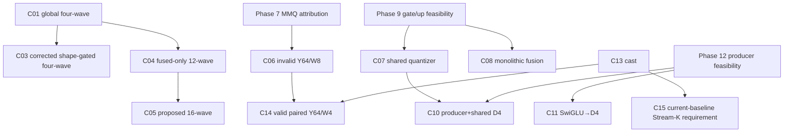

# Apex Phases 04–15 Dependency Map

## Baseline chronology

The historical PP gains from C07 and C11 are not additive predictions. Both predate C13, which reduced Q6_K MMQ time by `1.617272x` and changed runtime VGPR allocation from 232 to 256. They must be remeasured, not arithmetically carried forward.

## Candidate interaction matrix

| Candidate | Predates C13 | Q6_K MMQ interaction | N=1/TG interaction | Fused/producer interaction | TP/P2P interaction | Current-stack implication |
|---|---|---|---|---|---|---|
| C01/C03 four-wave MMV | Yes | No direct PP MMQ change | Direct N=1 launch geometry | Includes fused `ffn_up` selection/fallback | Exact TP slices used, but later Direct-P2P combination `NOT MEASURED` | C03 can be isolated as TG dispatch; C01 supplies exclusion evidence. |
| C04/C05 12/16-wave fused | Yes | No | Direct fused N=1 | Same `ffn_up` hotspot as C01/C03 | Later combination `NOT MEASURED` | C04’s flat local result makes it secondary to C03. |
| C06 Y64/W8 | Yes | Direct but structurally invalid | None intended | None | Not executed | Exact design remains invalid regardless of C13. |
| C07 shared Q8 | Yes | Reuses two Q6 MMQs; C13 accelerates those consumers | No | Changes quantizer/dispatch boundary | Graph/TP ownership passed; Direct-P2P later combination `NOT MEASURED` | Benefit may shrink or change after C13; current rerun needed. |
| C08 monolithic gate/up | Yes | Direct dual-accumulator kernel; old 229/230-VGPR baseline changed to 252/253 static after C13 | No | Strong fusion/intermediate traffic | Requires exact per-device ownership | Must redesign/resource-check on current kernel; old prediction cannot be reused. |
| C09 lane port | Yes | No | Direct N=1 | Potentially overlaps C01/C03/C04 launch geometry | Not implemented | Source premise remains absent unless new mechanism differs. |
| C10 RMSNorm→D4 | Yes | Feeds two Q6 MMQs accelerated by C13 | No | Producer+packing fusion; two consumers | Must retain per-device private buffer/graph lifetime | Connected share is lower after C13; rerank from current trace before implementation. |
| C11 SwiGLU→D4 | Yes | Feeds Q6 `ffn_down`, accelerated by C13 | No | Producer/format handoff removes separate ops | Graph/TP passed historically | Current rerun is necessary; patch may still remove non-MMQ overhead even if MMQ share fell. |
| C12 MMQ/all-reduce overlap | Yes | Direct scheduling interaction | No | None defined | Direct-P2P can materially alter communication topology/cost | Must trace current P2P service first; old overlap premise may be stale. |
| C13 explicit F32 cast | N/A | Became the registered Q6 MMQ baseline | TG protected at `.999895x` | No fusion change | TP/P2P dispatch equivalence passed | Foundation for all current PP comparisons. |
| C14 Y64/W4 | No; built on C13 | Direct geometry/resource change | Historical candidate was PP MMQ | None | Both devices measured | Already answers post-C13 PP question; no reason to infer pre-C13 result. |
| C15 Stream-K | Proposal spans C13 | Direct scheduling interaction and resource sensitivity | PP-only proposal | None defined | May interact with split and all-reduce timing | Must start from current Direct-P2P+C13 baseline. |

## Problem-lineage relationships

- C03 is the concrete refinement of C01, but it did not establish whole TG value; C01 is not treated as disproven solely by C03’s historical rejection.
- C14 is the structurally valid descendant of C06. C06 itself should not be built because its invariant failure is exact.
- C10 is not equivalent to C07: C07 shared a quantizer but retained the F32 producer boundary; C10 proposes eliminating that boundary as well.
- C13 did not supersede C12. It solved arithmetic throughput, not communication overlap.

## Later successful Apex work

The recovered phase artifacts explicitly establish C13 as a later successful dependency. They also show tensor-parallel/P2P equivalence checks, but they do not contain an audited combined run of C07, C11, or C03 with the later Direct-P2P/production patch set. Those combinations are therefore `NOT MEASURED`, regardless of whether current production includes Direct-P2P and Patch 13.

No candidate may be assumed additive with C13, Direct-P2P, FA-1, or later service work. The dependency map only identifies where a fresh comparison could differ.
